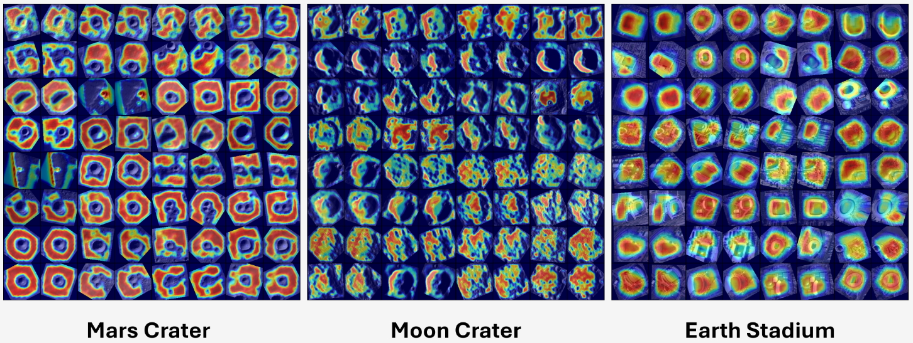

# MARs: Multi-view Attention Regularizations
### [Project Page](https://droneslab.github.io/mars/) | [Paper (Coming Soon)]() | [Luna-1 Dataset](https://github.com/droneslab/Luna-1/)

Repository for the ECCV 2024 paper title MARs: Multi-view Attention Regularizations for Patch-based Feature Recognition of Space Terrain.

MARs is a mechanism for aligning the attention information between multi-view patch-based features in metric learning descriptor networks:


Please check out the project page for more details.

## Installation
Install the required python packages:
```
pip install -r requirements.txt
```

## Getting Started
All dataset, training, and model settings are set in `cfg.yaml`. Check out this file for a detailed description of all options, including choice of convolution layer, attention layer, and metric learning loss function.
After configuration, you can run training by executing the following:
```
python train.py
```
in the `src/` directory. By default, model weights will be saved to `src/training_logs/`.

## Replicating Paper Results
To replicate the paper experiments, you can update the settings in `cfg.yaml` as follows:

**Earth Stadium**
```
landmarks_dir: 'path/to/resisc45/stadium/'
eval: True
```

**Mars Crater**
```
landmarks_dir: 'path/to/hirise/craters/'
eval: True
luna1_eval: True
luna1_annotation_file: '/path/to/luna1/lro_navigation/annotations.txt'
```

**Moon Crater (Luna-1)**
```
batch_size: 128
landmarks_dir: 'path/to/luna1/crater_images/'
eval: True
luna1_eval: True
luna1_annotation_file: '/path/to/luna1/lro_navigation/annotations.txt'
```

## Citation
```
@inproceedings{chase2024mars,
  title={MARs: Multi-view Attention Regularizations for Patch-based Feature Recognition of Space Terrain},
  author={Timothy Chase Jr and Karthik Dantu},
  year={2024},
  booktitle={ECCV},
}
